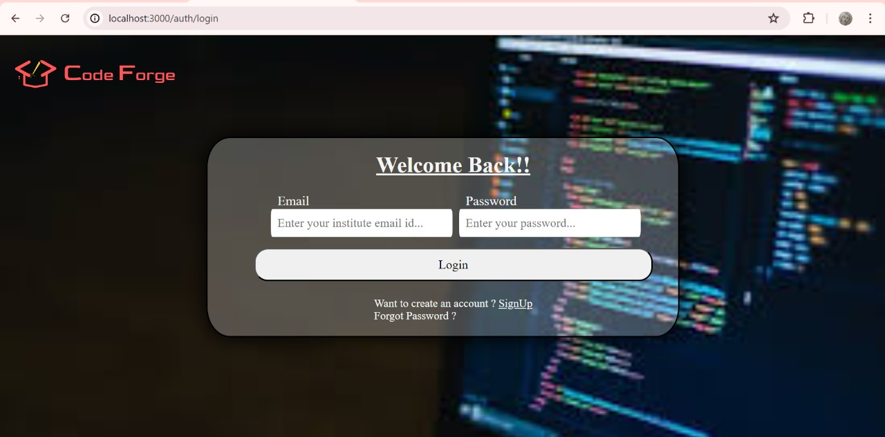
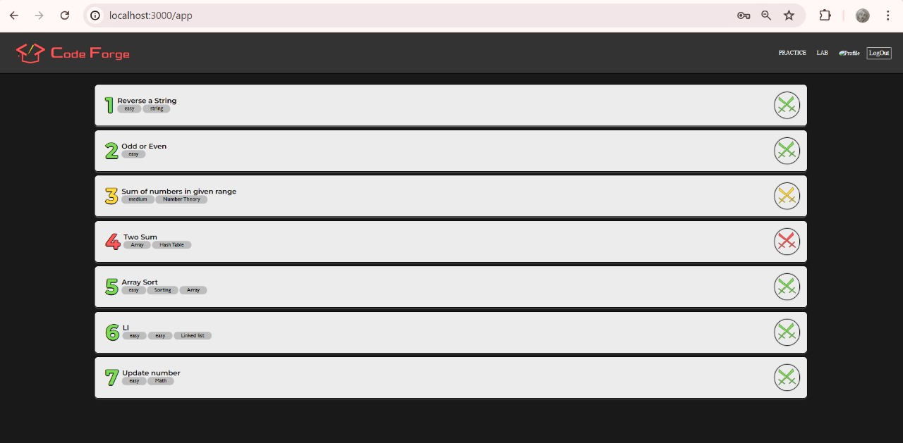
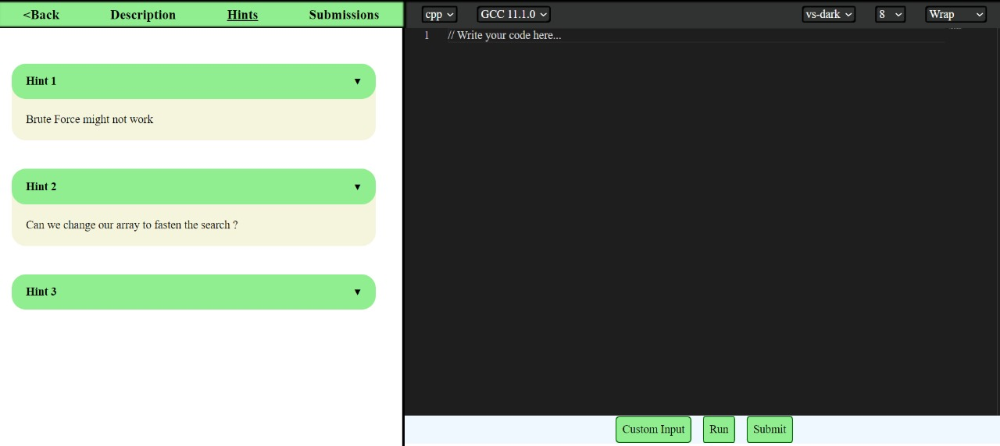
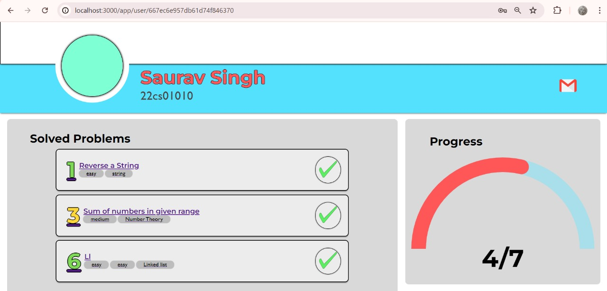
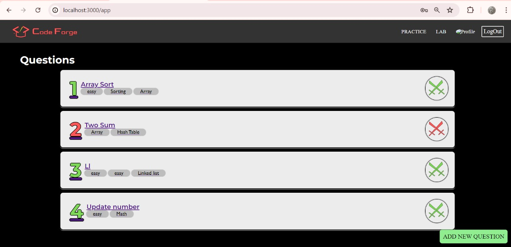
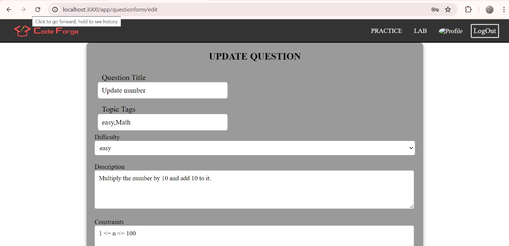
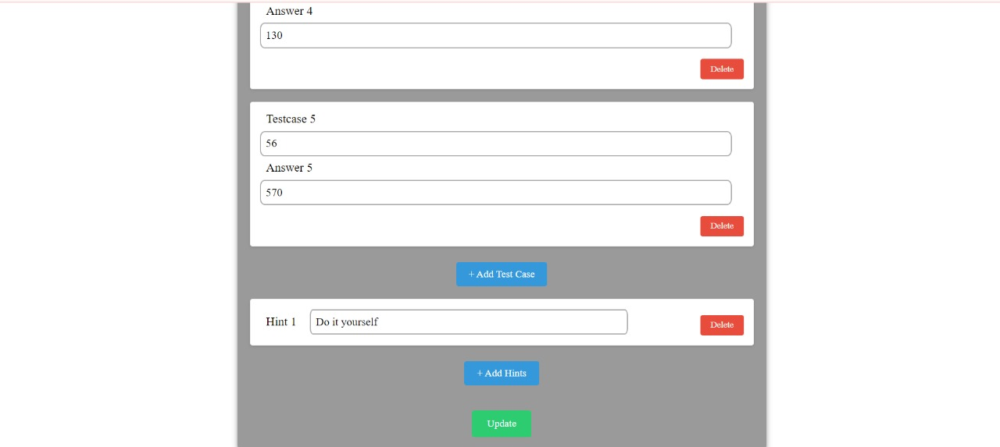
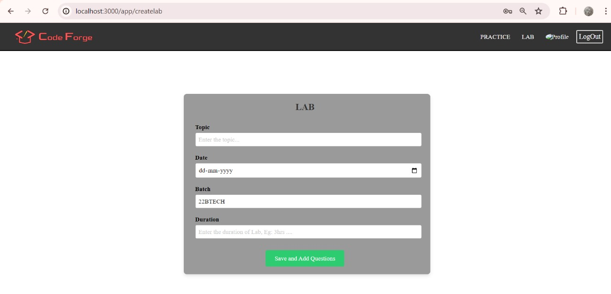

**Project Name:** CodeForge

(project in progress)

**Description:**

CodeForge is a web application designed to streamline the management and execution of computer science labs, particularly for Data Structures and Algorithms (DSA) courses in colleges, with a focus on institutions like IITs. It aims to empower instructors to create and assign DSA problems, 
track student progress, and analyze their performance.

**Technologies:**

* **MERN Stack:**
    * **MongoDB:** NoSQL database for flexible data storage (server-side)
    * **Express.js:** Web framework for building the backend API (server-side)
    * **React.js:** JavaScript library for creating the user interface (client-side)
    * **Node.js:** JavaScript runtime environment for server-side execution

**Frontend Repository:**

([https://github.com/ayush07agrawal/CodeForge_FrontEnd](https://github.com/ayush07agrawal/CodeForge_FrontEnd))

**Backend Repository:**

[https://github.com/sauravatgithub-web/CodeForge_server](https://github.com/sauravatgithub-web/CodeForge_server)

**Installation:**

**Prerequisites:**

* Node.js and npm (or yarn) installed on your system.
* A MongoDB database instance running locally or on a cloud provider.

**Frontend Installation  (refer to [https://github.com/ayush07agrawal/CodeForge_FrontEnd](https://github.com/ayush07agrawal/CodeForge_FrontEnd) for specific instructions):**

1. Clone this repository:

   ```bash
   git clone https://github.com/ayush07agrawal/CodeForge_FrontEnd.git
   ```

2. Navigate to the project directory:

   ```bash
   cd CodeForge_FrontEnd
   ```

3. Install dependencies:

   ```bash
   npm install  # or yarn install
   ```

**Backend Installation:**

1. Clone the server-side repository from the provided link.
2. Install dependencies within the server-side repository.
3. Configure the database connection details in the server-side code.

**Running the Application:**

**Frontend (refer to [https://github.com/ayush07agrawal/CodeForge_FrontEnd](https://github.com/ayush07agrawal/CodeForge_FrontEnd) for specific instructions):**

1. Start the development server:

   ```bash
   npm start  # or yarn start
   ```

2. The application will typically run on `http://localhost:3000` (adjust the port if necessary).

**Backend**

1. Start the backend server in the server-side repository according to its documentation.

**Usage:**

* Once both frontend and backend are running, instructors and students can access the application to create/assign problems, submit solutions, and view performance metrics.

**Site Images**
* Here are some screenshots taken while testing. We will be updating these as and when we update the concerned part of the site.

* Login - 


* Student Home Screen (List of PYQs) 


* Code Editor (Question Solving Screen)


* Hints Screen


* Past Submissions


* Attend Lab - 


* Profile Section 


* Teacher Home Screen


* Question Form


* User Friendly Input Method


* Create Lab - 



**Contributing:**

We welcome contributions to improve CodeForge! Feel free to fork this repository, create a branch for your changes, and submit a pull request. 


**Disclaimer:**

This project is provided for educational purposes only. While we strive to ensure its functionality, we do not guarantee its suitability for any specific use case.
